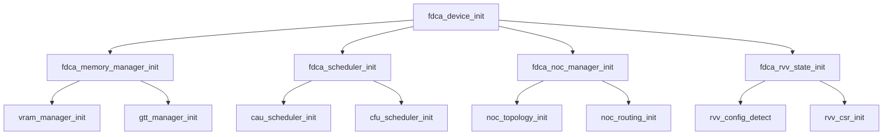
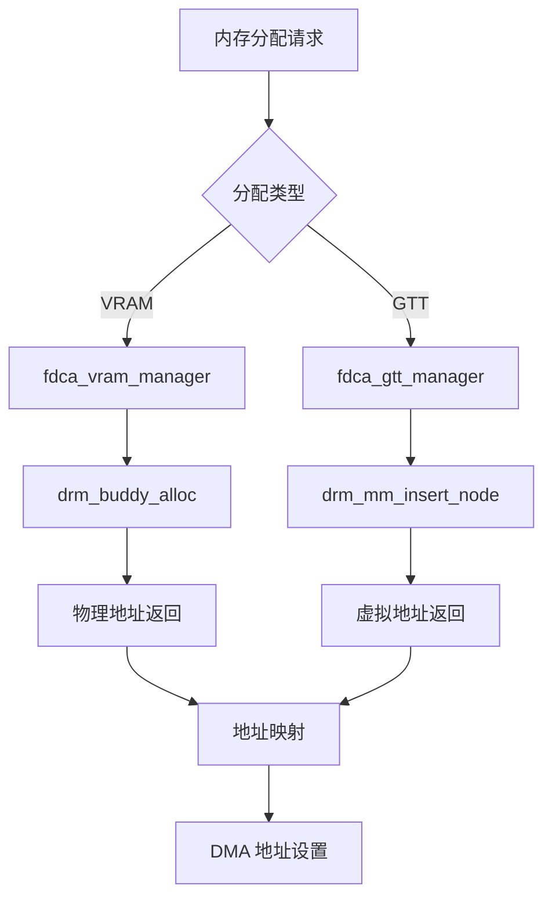

# FDCA KMD 核心数据结构设计文档

## 文件概述

**文件名**: `fdca_drv.h`  
**作用**: FDCA 内核模式驱动的核心头文件，定义所有关键数据结构和常量  
**依赖**: Linux DRM 子系统、PCI 子系统、RISC-V 向量扩展相关头文件  

## 设计理念

### 1. 分布式异构计算架构
本设计围绕昉擎的核心理念构建：
- **上下文相关单元 (CAU)**: 专门优化访存密集型任务（如 Attention 机制）
- **上下文无关单元 (CFU)**: 专门优化计算密集型任务（如 FFN 网络）

### 2. RISC-V 向量扩展深度集成
- 完整支持 RVV 1.0 标准的所有特性
- 基于 `ara` 项目的硬件架构设计
- 动态向量长度和多 Lane 并行处理

### 3. 现代 Linux 驱动框架
- 基于 DRM 子系统的标准化接口
- 使用 `drm_buddy` 和 `drm_mm` 的先进内存管理
- 支持电源管理、错误恢复和性能监控

## 核心数据结构详解

### 主设备结构 (`struct fdca_device`)

```
fdca_device (主控制器)
├── drm_device (DRM 核心)
├── pci_dev (PCI 设备)
├── units[2] (计算单元)
│   ├── CAU (上下文相关单元)
│   └── CFU (上下文无关单元)
├── rvv_config (RVV 配置)
├── mem_mgr (内存管理器)
├── schedulers[2] (调度器)
├── noc_mgr (NoC 管理器)
└── ctx_idr (上下文管理)
```

#### 关键字段说明

**硬件抽象层**:
- `units[FDCA_UNIT_MAX]`: 两个异构计算单元的硬件抽象
- `mmio_base`: 统一的 MMIO 访问入口
- `rvv_config`: RISC-V 向量扩展的完整硬件配置

**子系统管理**:
- `mem_mgr`: 统一内存管理器，整合 VRAM 和 GTT
- `schedulers[2]`: 为每个计算单元提供专用调度器
- `noc_mgr`: 片上网络管理，确保低延迟通信

**状态管理**:
- `state`: 设备生命周期状态机
- `pm`: 电源管理和运行时挂起支持
- `recovery`: 错误恢复和设备重置机制

### RVV 配置结构 (`struct fdca_rvv_config`)

```
rvv_config
├── 基础配置
│   ├── vlen (向量长度)
│   ├── elen (元素长度)
│   ├── num_lanes (并行 Lane 数)
│   └── vlenb (向量长度字节数)
├── 硬件能力
│   ├── fp_support (浮点支持)
│   ├── fixed_point_support (定点支持)
│   ├── segment_support (分段操作)
│   └── os_support (OS/MMU 支持)
└── 性能参数
    ├── multiplier_latency[4] (乘法器延迟)
    ├── fpu_latency[5] (FPU 延迟)
    ├── vrf_size_per_lane (VRF 大小)
    └── vrf_banks_per_lane (VRF 存储体数)
```

#### 设计亮点

1. **基于 ara 项目的参数**: 直接参考了 `ara_pkg.sv` 中的硬件定义
2. **性能感知配置**: 不同数据宽度的延迟参数，支持性能优化
3. **可扩展架构**: 支持 2-16 个 Lane 的灵活配置

### 内存管理架构

```
memory_manager
├── vram_manager (设备内存)
│   ├── drm_buddy (buddy 分配器)
│   ├── 统计信息 (分配/释放计数)
│   └── 碎片整理 (defrag_work)
├── gtt_manager (虚拟地址)
│   ├── drm_mm (地址空间管理)
│   ├── page_table (页表管理)
│   └── 映射统计 (map/unmap 计数)
└── 内存池
    ├── small_pool (小块内存池)
    ├── large_pool (大块内存池)
    └── cached_objects (缓存对象)
```

#### 关键特性

1. **双层内存管理**: VRAM (设备本地) + GTT (虚拟地址空间)
2. **现代分配器**: `drm_buddy` 用于 VRAM，`drm_mm` 用于虚拟地址
3. **性能优化**: 内存池、缓存机制、碎片整理
4. **统计支持**: 完整的分配统计，支持性能分析

### 队列和调度系统

```
调度系统
├── fdca_scheduler (调度器基类)
│   ├── active_queues (活跃队列)
│   ├── pending_queues (待调度队列)
│   ├── schedule_work (调度工作)
│   └── 性能统计
└── fdca_queue (队列基类)
    ├── cmd_buffer (命令缓冲区)
    ├── rvv_state (RVV 状态)
    ├── 同步机制 (wait_queue)
    └── 性能统计
```

#### 专业化设计

1. **队列类型多样化**:
   - `FDCA_QUEUE_CAU_MEM`: CAU 内存访问队列
   - `FDCA_QUEUE_CAU_COMPUTE`: CAU 计算队列
   - `FDCA_QUEUE_CFU_VECTOR`: CFU 向量计算队列
   - `FDCA_QUEUE_CFU_SCALAR`: CFU 标量计算队列

2. **调度策略优化**:
   - CAU 调度器：优化内存带宽和缓存命中率
   - CFU 调度器：优化计算单元利用率和向量化效率

### NoC (片上网络) 架构

```
noc_manager
├── 网络拓扑
│   ├── nodes[] (节点数组)
│   ├── mesh_width/height (网格尺寸)
│   └── routing_table (路由表)
├── 配置参数
│   ├── packet_size (数据包大小)
│   ├── buffer_depth (缓冲区深度)
│   └── clock_freq (时钟频率)
└── 监控系统
    ├── 性能统计 (延迟/吞吐量)
    ├── 拥塞控制
    └── 实时监控
```

#### 核心价值

1. **低延迟通信**: CAU 和 CFU 之间的高速数据交换
2. **拥塞控制**: 智能流量管理，避免网络拥塞
3. **性能监控**: 实时延迟和吞吐量监控

## 调用关系图

### 初始化序列



### 运行时调用


### 内存分配流程



## 编译依赖关系

### 头文件依赖

```
fdca_drv.h
├── Linux 内核头文件
│   ├── linux/pci.h (PCI 支持)
│   ├── linux/device.h (设备模型)
│   ├── linux/mutex.h (同步原语)
│   ├── linux/spinlock.h (自旋锁)
│   ├── linux/workqueue.h (工作队列)
│   ├── linux/idr.h (ID 管理)
│   ├── linux/kref.h (引用计数)
│   └── linux/dma-mapping.h (DMA 支持)
└── DRM 子系统头文件
    ├── drm/drm_device.h (DRM 设备)
    ├── drm/drm_drv.h (DRM 驱动)
    ├── drm/drm_file.h (DRM 文件操作)
    ├── drm/drm_mm.h (地址空间管理)
    ├── drm/drm_buddy.h (buddy 分配器)
    └── drm/drm_gem.h (GEM 对象)
```

### 模块间依赖

```
fdca_drv.h (核心定义)
├── 被以下模块包含
│   ├── fdca_pci.c (PCI 驱动)
│   ├── fdca_drm.c (DRM 接口)
│   ├── fdca_vram.c (VRAM 管理)
│   ├── fdca_gtt.c (GTT 管理)
│   ├── fdca_rvv_*.c (RVV 相关)
│   ├── fdca_queue.c (队列管理)
│   ├── fdca_scheduler.c (调度器)
│   ├── fdca_noc.c (NoC 管理)
│   └── 其他所有模块
└── 提供以下服务
    ├── 数据结构定义
    ├── 常量定义
    ├── 宏定义
    ├── 函数声明
    └── 类型安全检查
```

## 设计亮点总结

### 1. 模块化设计
- 每个子系统都有清晰的接口定义
- 支持独立测试和模块化加载
- 便于后续功能扩展

### 2. 性能导向
- 详细的性能统计收集
- 针对不同计算模式的专用优化
- 支持实时性能监控和调优

### 3. 错误恢复
- 完整的错误状态管理
- 设备重置和恢复机制
- 调试和诊断支持

### 4. 标准兼容
- 完全基于 Linux DRM 框架
- 遵循 RISC-V RVV 1.0 标准
- 符合现代内核驱动开发规范

## 下一步计划

1. **实现 PCI 设备注册** (`fdca_pci.c`)
2. **实现 DRM 设备框架** (`fdca_drm.c`)
3. **实现内存管理子系统** (`fdca_vram.c`, `fdca_gtt.c`)
4. **实现 RVV 状态管理** (`fdca_rvv_state.c`)

每个模块都将基于此核心头文件的定义进行实现，确保整个驱动系统的一致性和可维护性。
