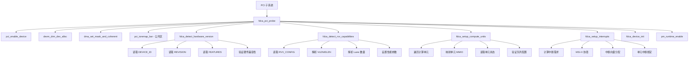
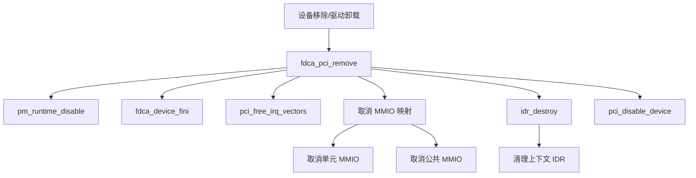
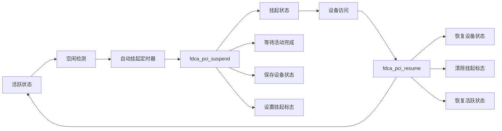

# FDCA PCI 驱动模块设计文档

## 文件概述

**文件名**: `fdca_pci.c`  
**作用**: PCI 设备注册、硬件探测和基础初始化  
**依赖**: `fdca_drv.h`, Linux PCI 子系统, DRM 框架  

## 模块职责

### 1. PCI 设备生命周期管理
- **设备探测**: 自动发现和识别 FDCA 硬件设备
- **资源分配**: MMIO 映射、DMA 配置、中断分配
- **设备注册**: 向 DRM 子系统注册设备
- **电源管理**: 运行时挂起/恢复支持

### 2. 硬件抽象层
- **计算单元识别**: 自动检测 CAU 和 CFU 的存在和配置
- **RVV 能力检测**: 读取并解析 RISC-V 向量扩展的硬件能力
- **版本兼容性**: 支持多个硬件版本的向后兼容

### 3. 系统集成
- **中断支持**: MSI-X、MSI 和传统中断的自适应配置
- **DMA 支持**: 64位/32位 DMA 地址空间的自动协商
- **错误处理**: 完整的错误恢复和设备重置机制

## 核心数据结构

### PCI 设备 ID 表

```c
static const struct pci_device_id fdca_pci_ids[] = {
    {
        .vendor = FDCA_VENDOR_ID,           // 昉擎科技厂商 ID
        .device = FDCA_DEVICE_ID_V1,        // 设备 ID v1.0
        .class = PCI_CLASS_PROCESSING_ACCELERATOR,  // 处理加速器类
        .driver_data = 1,                   // 版本标识
    },
    // ... 其他设备版本
};
```

### 硬件寄存器布局

```
MMIO 寄存器映射
├── 0x0000: DEVICE_ID      (设备标识)
├── 0x0004: REVISION       (硬件版本)
├── 0x0008: FEATURES       (特性标志)
├── 0x0010: CAU_STATUS     (CAU 状态)
├── 0x0014: CFU_STATUS     (CFU 状态)
├── 0x0020: RVV_CONFIG     (RVV 配置)
├── 0x0030: NOC_CONFIG     (NoC 配置)
└── 0x0040: POWER_STATUS   (电源状态)
```

## 关键算法实现

### 1. 硬件版本检测 (`fdca_detect_hardware_version`)

```
硬件检测流程
├── 读取设备寄存器
│   ├── DEVICE_ID → 确定芯片型号
│   ├── REVISION → 获取硬件版本
│   └── FEATURES → 解析硬件能力
├── 验证硬件兼容性
│   ├── 检查设备 ID 有效性
│   ├── 验证必要功能单元
│   └── 设置芯片名称
└── 配置计算单元
    ├── CAU 存在检测
    ├── CFU 存在检测
    └── RVV 支持检测
```

#### 特性寄存器位定义
```c
#define FDCA_FEATURE_CAU_PRESENT    BIT(0)  // CAU 单元存在
#define FDCA_FEATURE_CFU_PRESENT    BIT(1)  // CFU 单元存在
#define FDCA_FEATURE_RVV_SUPPORT    BIT(2)  // RVV 支持
#define FDCA_FEATURE_FP_SUPPORT     BIT(3)  // 浮点支持
#define FDCA_FEATURE_NOC_SUPPORT    BIT(4)  // NoC 支持
#define FDCA_FEATURE_PM_SUPPORT     BIT(5)  // 电源管理支持
```

### 2. RVV 能力检测 (`fdca_detect_rvv_capabilities`)

```
RVV 配置解析
├── 读取 RVV_CONFIG 寄存器
├── 解析配置参数
│   ├── bits[3:0]: VLEN 倍数
│   ├── bits[6:4]: ELEN 编码  
│   ├── bits[11:8]: Lane 数量
│   └── bits[16:19]: 硬件能力位
├── 计算衍生参数
│   ├── vlenb = vlen / 8
│   ├── vrf_size_per_lane
│   └── vrf_banks_per_lane
└── 验证配置合理性
    ├── VLEN 范围检查 (128 - 65536)
    ├── ELEN 上限检查 (≤ 64)
    └── Lane 数量检查 (1 - 16)
```

#### RVV 配置示例
```c
// 基于 ara 项目的延迟参数
config->multiplier_latency[0] = 0;  // EW8: 0 cycle
config->multiplier_latency[1] = 1;  // EW16: 1 cycle
config->multiplier_latency[2] = 1;  // EW32: 1 cycle
config->multiplier_latency[3] = 1;  // EW64: 1 cycle

config->fpu_latency[0] = 5;         // FComp: 5 cycles
config->fpu_latency[1] = 3;         // FDiv/Sqrt: 3 cycles
config->fpu_latency[2] = 2;         // FConv: 2 cycles
config->fpu_latency[3] = 1;         // FNonComp: 1 cycle
config->fpu_latency[4] = 0;         // FDotp: 0 cycle
```

### 3. 计算单元设置 (`fdca_setup_compute_units`)

```
计算单元配置
├── 遍历所有单元类型 (CAU, CFU)
├── 对每个存在的单元
│   ├── 确定 BAR 索引
│   │   ├── CAU → BAR 0
│   │   └── CFU → BAR 2
│   ├── 验证 BAR 资源
│   │   ├── 地址和大小有效性
│   │   └── 内存类型检查
│   ├── 映射 MMIO 区域
│   │   └── pci_ioremap_bar()
│   ├── 读取单元状态
│   │   ├── 队列数量
│   │   └── 计算单元数
│   └── 验证配置合理性
└── 错误处理和资源清理
```

### 4. 中断系统配置 (`fdca_setup_interrupts`)

```
中断配置策略
├── 计算中断需求
│   ├── 1 个全局中断
│   ├── CAU 单元中断 (如果存在)
│   └── CFU 单元中断 (如果存在)
├── 中断类型协商
│   ├── 优先尝试 MSI-X
│   ├── 降级到 MSI
│   └── 最后使用传统中断
├── 中断向量分配
│   └── pci_alloc_irq_vectors()
└── 单元中断绑定
    └── pci_irq_vector()
```

## 调用关系图

### 设备探测序列



### 设备移除序列



### 电源管理流程



## 错误处理机制

### 1. 探测阶段错误处理

```
探测错误处理
├── PCI 启用失败
│   └── 直接返回错误
├── DRM 设备分配失败
│   └── 禁用 PCI 设备
├── DMA 掩码设置失败
│   └── 释放 DRM 设备
├── MMIO 映射失败
│   └── 释放已分配资源
├── 硬件检测失败
│   └── 取消 MMIO 映射
├── 单元设置失败
│   └── 取消所有映射
└── 中断设置失败
    └── 完整资源清理
```

### 2. 运行时错误恢复

```c
struct {
    struct work_struct reset_work;      // 重置工作队列
    atomic_t reset_count;               // 重置计数器
    bool recovery_active;               // 恢复进行中标志
    struct mutex recovery_lock;         // 恢复锁
} recovery;
```

## 性能优化

### 1. DMA 优化
- **64位 DMA 优先**: 支持大内存系统的高效访问
- **32位 DMA 降级**: 兼容老旧系统
- **DMA 一致性**: 确保缓存一致性

### 2. 中断优化
- **MSI-X 优先**: 每个计算单元独立中断，减少中断延迟
- **中断合并**: 传统中断模式下的中断合并策略
- **中断亲和性**: 绑定中断到特定 CPU 核心

### 3. 内存映射优化
- **按需映射**: 仅映射存在的计算单元
- **映射验证**: 严格的地址和大小验证
- **资源管理**: 自动资源清理和错误恢复

## 调试和监控

### 1. 日志系统

```c
// 分级日志宏
#define fdca_err(fdev, fmt, args...)    // 错误日志
#define fdca_warn(fdev, fmt, args...)   // 警告日志
#define fdca_info(fdev, fmt, args...)   // 信息日志
#define fdca_dbg(fdev, fmt, args...)    // 调试日志
```

### 2. 统计信息

```c
// 启动时间记录
fdev->stats.uptime_start = ktime_get_boottime_seconds();

// 原子计数器
atomic64_set(&fdev->stats.total_commands, 0);
atomic64_set(&fdev->stats.total_interrupts, 0);
```

### 3. 状态跟踪

```c
enum {
    FDCA_DEV_STATE_INIT = 0,        // 初始化中
    FDCA_DEV_STATE_ACTIVE,          // 活跃状态
    FDCA_DEV_STATE_SUSPENDED,       // 挂起状态
    FDCA_DEV_STATE_ERROR,           // 错误状态
    FDCA_DEV_STATE_RESETTING,       // 重置中
} state;
```

## 与其他模块的接口

### 1. 向上接口 (提供给 DRM 层)

```c
// DRM 设备注册
devm_drm_dev_alloc(&pdev->dev, &fdca_drm_driver, struct fdca_device, drm);

// 设备初始化回调
int fdca_device_init(struct fdca_device *fdev);
void fdca_device_fini(struct fdca_device *fdev);
```

### 2. 向下接口 (PCI 子系统)

```c
// PCI 驱动注册
static struct pci_driver fdca_pci_driver = {
    .name = FDCA_DRIVER_NAME,
    .id_table = fdca_pci_ids,
    .probe = fdca_pci_probe,
    .remove = fdca_pci_remove,
};
```

### 3. 横向接口 (其他子系统)

```c
// 内存管理器初始化
int fdca_memory_manager_init(struct fdca_device *fdev);

// 调度器初始化  
int fdca_scheduler_init(struct fdca_device *fdev);

// RVV 状态管理初始化
int fdca_rvv_state_init(struct fdca_device *fdev);
```

## 编译和依赖

### 编译要求

```makefile
# 内核版本要求
CONFIG_PCI=y                    # PCI 支持
CONFIG_DRM=y                    # DRM 支持  
CONFIG_PM=y                     # 电源管理
CONFIG_PM_RUNTIME=y             # 运行时电源管理
CONFIG_64BIT=y                  # 64位支持 (推荐)
```

### 头文件依赖

```c
#include <linux/module.h>       // 模块支持
#include <linux/pci.h>          // PCI 子系统
#include <linux/interrupt.h>    // 中断处理
#include <linux/io.h>           // I/O 操作
#include <linux/pm_runtime.h>   // 运行时电源管理
#include "fdca_drv.h"           // FDCA 核心定义
```

## 测试和验证

### 1. 功能测试
- **设备探测**: 验证不同硬件版本的正确识别
- **资源分配**: 测试 MMIO 映射和中断分配
- **错误处理**: 模拟各种错误条件的处理

### 2. 性能测试
- **中断延迟**: 测量中断响应时间
- **DMA 吞吐量**: 测试不同 DMA 配置的性能
- **电源管理**: 验证挂起/恢复的延迟

### 3. 兼容性测试
- **多设备支持**: 测试多个 FDCA 设备的并存
- **热插拔**: 验证设备热插拔的稳定性
- **内核版本**: 测试不同内核版本的兼容性

## 下一步计划

1. **实现 DRM 接口** (`fdca_drm.c`) - 提供用户空间访问接口
2. **实现内存管理** (`fdca_vram.c`, `fdca_gtt.c`) - 设备内存管理
3. **实现 RVV 状态管理** (`fdca_rvv_state.c`) - 向量扩展支持
4. **实现中断处理** - 完善中断服务例程

本模块为整个 FDCA 驱动提供了坚实的硬件抽象基础，确保了设备的正确识别、资源的有效分配和系统的稳定运行。
