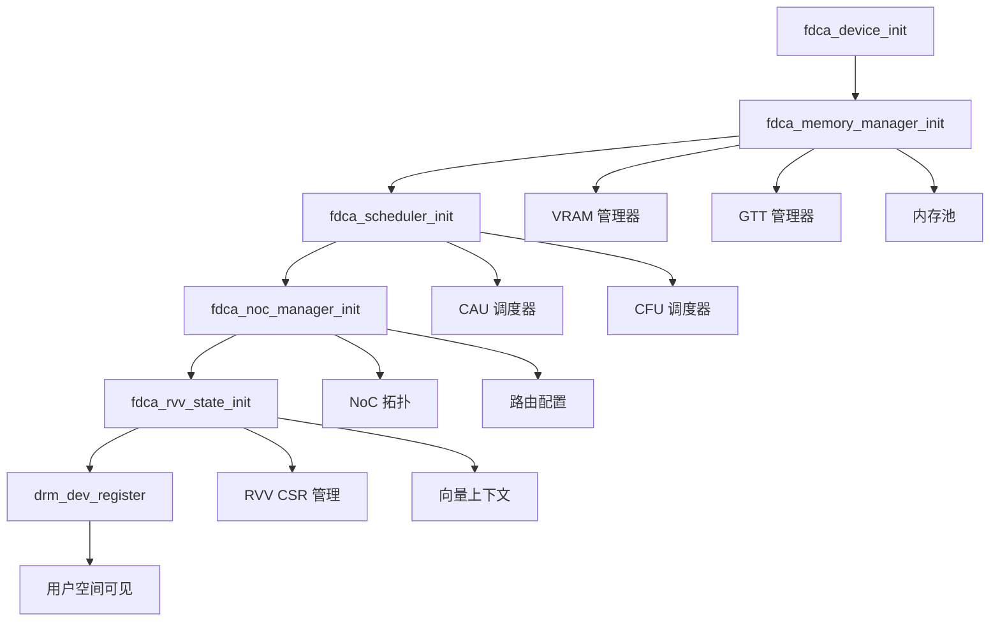
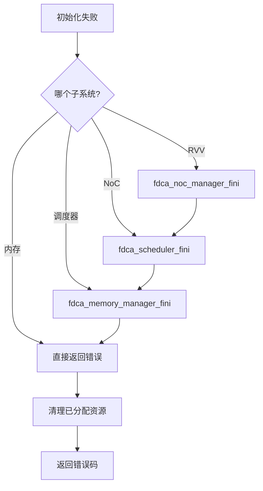

# FDCA DRM 驱动模块设计文档

## 文件概述

**文件名**: `fdca_drm.c`  
**作用**: DRM 设备注册、用户空间接口和设备生命周期管理  
**依赖**: `fdca_drv.h`, Linux DRM 子系统, 同步框架  

## 模块职责

### 1. DRM 设备生命周期管理
- **设备注册**: 向 DRM 子系统注册 FDCA 设备
- **子系统协调**: 初始化和管理所有 FDCA 子系统
- **错误恢复**: 提供完整的初始化失败恢复机制
- **资源清理**: 设备移除时的有序资源释放

### 2. 用户空间接口
- **文件操作**: 提供标准的 open/close 操作
- **上下文管理**: 为每个用户进程创建独立的执行上下文
- **IOCTL 接口**: 实现设备特定的控制接口
- **内存映射**: 支持 GEM 对象的用户空间映射

### 3. 计算加速器支持
- **渲染无关**: 作为纯计算加速器运行，不涉及图形渲染
- **异步执行**: 支持命令的异步提交和执行
- **同步原语**: 提供 fence 和 timeline 同步机制
- **多进程支持**: 安全的多进程并发访问

## 核心数据结构

### DRM 驱动结构

```c
const struct drm_driver fdca_drm_driver = {
    .driver_features = DRIVER_GEM |           // GEM 内存管理
                      DRIVER_COMPUTE_ACCEL |  // 计算加速器
                      DRIVER_SYNCOBJ,         // 同步对象支持
    
    .open = fdca_drm_open,                   // 设备打开
    .postclose = fdca_drm_postclose,         // 设备关闭后处理
    
    .ioctls = fdca_ioctls,                   // IOCTL 表
    .num_ioctls = ARRAY_SIZE(fdca_ioctls),   // IOCTL 数量
    
    .fops = &fdca_drm_fops,                  // 文件操作
};
```

### 上下文结构 (`struct fdca_context`)

```
fdca_context (用户进程上下文)
├── 基础信息
│   ├── ctx_id (上下文 ID)
│   ├── pid (进程 PID)
│   ├── file (DRM 文件)
│   └── ref (引用计数)
├── 队列管理
│   ├── queues[FDCA_QUEUE_MAX] (队列数组)
│   └── queue_lock (队列锁)
├── RVV 状态
│   ├── rvv_state (CSR 状态)
│   ├── rvv_enabled (启用标志)
│   └── vector_context_id (向量上下文 ID)
├── 内存管理
│   ├── vma_list (VMA 列表)
│   └── vma_lock (VMA 锁)
├── 同步管理
│   ├── sync_idr (同步对象 IDR)
│   └── sync_lock (同步锁)
└── 统计信息
    ├── submit_count (提交计数)
    ├── gpu_time_ns (GPU 时间)
    ├── create_time (创建时间)
    └── last_activity (最后活动时间)
```

## IOCTL 接口设计

### 1. 设备参数查询 (`FDCA_GET_PARAM`)

```c
struct drm_fdca_get_param {
    __u32 param;        // 参数类型
    __u32 pad;          // 填充字节
    __u64 value;        // 参数值
};
```

#### 支持的参数类型
```c
#define FDCA_PARAM_DEVICE_ID     0  // 设备 ID
#define FDCA_PARAM_REVISION      1  // 硬件版本
#define FDCA_PARAM_RVV_VLEN      2  // RVV 向量长度
#define FDCA_PARAM_RVV_ELEN      3  // RVV 元素长度
#define FDCA_PARAM_RVV_LANES     4  // RVV Lane 数量
#define FDCA_PARAM_CAU_QUEUES    5  // CAU 队列数量
#define FDCA_PARAM_CFU_QUEUES    6  // CFU 队列数量
#define FDCA_PARAM_VRAM_SIZE     7  // VRAM 大小
#define FDCA_PARAM_GTT_SIZE      8  // GTT 大小
```

#### 使用示例
```c
// 查询 RVV 向量长度
struct drm_fdca_get_param param = {
    .param = FDCA_PARAM_RVV_VLEN,
};
ioctl(fd, DRM_IOCTL_FDCA_GET_PARAM, &param);
printf("VLEN = %llu bits\n", param.value);
```

### 2. GEM 对象管理

#### 创建 (`FDCA_GEM_CREATE`)
```c
struct drm_fdca_gem_create {
    __u64 size;         // 对象大小
    __u32 flags;        // 创建标志
    __u32 handle;       // 输出：对象句柄
};
```

#### 映射 (`FDCA_GEM_MMAP`)
```c
struct drm_fdca_gem_mmap {
    __u32 handle;       // 对象句柄
    __u32 flags;        // 映射标志
    __u64 offset;       // 输出：映射偏移
};
```

### 3. 命令提交和同步

#### 命令提交 (`FDCA_SUBMIT`)
```c
struct drm_fdca_submit {
    __u64 commands;     // 命令缓冲区指针
    __u32 commands_size;// 命令大小
    __u32 queue_id;     // 队列 ID
    __u32 fence_out;    // 输出：fence 句柄
    __u32 flags;        // 提交标志
};
```

#### 同步等待 (`FDCA_WAIT`)
```c
struct drm_fdca_wait {
    __u32 fence;        // fence 句柄
    __u32 flags;        // 等待标志
    __u64 timeout_ns;   // 超时时间(纳秒)
};
```

## 设备初始化序列

### 子系统初始化顺序



### 错误恢复机制



## 用户空间交互流程

### 1. 设备打开流程

```mermaid
graph TD
    A[用户 open(/dev/dri/renderD*)] --> B[fdca_drm_open]
    B --> C[分配 fdca_context]
    C --> D[初始化上下文]
    D --> E[分配上下文 ID]
    E --> F[增加引用计数]
    F --> G[返回文件描述符]
    
    D --> D1[初始化锁和列表]
    D --> D2[RVV 状态初始化]
    D --> D3[统计信息初始化]
    
    E --> E1[idr_alloc]
    E --> E2[ctx_count++]
    
    F --> F1[pm.usage_count++]
```

### 2. 设备关闭流程

```mermaid
graph TD
    A[用户 close(fd)] --> B[fdca_drm_postclose]
    B --> C[从 ctx_idr 移除]
    C --> D[减少计数器]
    D --> E[kref_put]
    E --> F[fdca_context_release]
    
    C --> C1[idr_remove]
    
    D --> D1[ctx_count--]
    D --> D2[pm.usage_count--]
    
    F --> F1[清理同步对象]
    F --> F2[清理 VMA 列表]
    F --> F3[释放队列]
    F --> F4[释放内存]
```

### 3. IOCTL 处理流程

```mermaid
graph LR
    A[用户 ioctl()] --> B[drm_ioctl]
    B --> C[查找 IOCTL 表]
    C --> D[权限检查]
    D --> E[参数复制]
    E --> F[调用处理函数]
    F --> G[结果返回]
    
    F --> F1[fdca_ioctl_get_param]
    F --> F2[fdca_ioctl_gem_create]
    F --> F3[fdca_ioctl_submit]
    F --> F4[fdca_ioctl_wait]
```

## 内存和资源管理

### 1. 上下文生命周期

```c
// 上下文创建
struct fdca_context *ctx = kzalloc(sizeof(*ctx), GFP_KERNEL);
kref_init(&ctx->ref);           // 初始引用计数为 1

// 上下文使用
kref_get(&ctx->ref);            // 增加引用
// ... 使用上下文 ...
kref_put(&ctx->ref, fdca_context_release);  // 减少引用

// 上下文自动释放
static void fdca_context_release(struct kref *ref) {
    // 清理所有资源
    // 释放内存
}
```

### 2. IDR 管理

```c
// 上下文 ID 分配
mutex_lock(&fdev->ctx_lock);
ret = idr_alloc(&fdev->ctx_idr, ctx, 1, 0, GFP_KERNEL);
ctx->ctx_id = ret;
mutex_unlock(&fdev->ctx_lock);

// 上下文查找
mutex_lock(&fdev->ctx_lock);
ctx = idr_find(&fdev->ctx_idr, ctx_id);
mutex_unlock(&fdev->ctx_lock);

// 上下文移除
mutex_lock(&fdev->ctx_lock);
idr_remove(&fdev->ctx_idr, ctx->ctx_id);
mutex_unlock(&fdev->ctx_lock);
```

### 3. 电源管理集成

```c
// 设备打开时增加使用计数
atomic_inc(&fdev->pm.usage_count);

// 设备关闭时减少使用计数
atomic_dec(&fdev->pm.usage_count);

// 检查是否可以挂起
if (atomic_read(&fdev->pm.usage_count) == 0) {
    // 可以进入挂起状态
}
```

## 性能优化策略

### 1. 快速路径优化
- **IOCTL 参数验证**: 最小化参数检查开销
- **上下文查找**: 使用文件私有数据直接访问
- **引用计数**: 避免不必要的原子操作

### 2. 内存分配策略
```c
// 使用 GFP_KERNEL 为常规分配
ctx = kzalloc(sizeof(*ctx), GFP_KERNEL);

// 对于可能在中断上下文的分配使用 GFP_ATOMIC
// (在后续的中断处理中使用)
```

### 3. 锁策略
- **细粒度锁**: 每个子系统使用独立的锁
- **读写锁**: 对于频繁读取的数据结构
- **无锁数据结构**: 对于性能关键路径

## 调试和监控

### 1. 统计信息收集

```c
// 上下文级统计
atomic64_inc(&ctx->submit_count);          // 提交计数
ctx->last_activity = ktime_get_boottime_seconds();  // 活动时间

// 设备级统计  
atomic_inc(&fdev->ctx_count);              // 活跃上下文数
fdca_stats_inc(fdev, total_commands);      // 总命令数
```

### 2. 日志和调试

```c
// 分级日志
fdca_info(fdev, "上下文 %u 创建成功\n", ctx->ctx_id);
fdca_dbg(fdev, "获取参数: %u\n", args->param);
fdca_err(fdev, "无效参数类型: %u\n", args->param);
```

### 3. 状态跟踪

```c
// 上下文状态
ctx->create_time = ktime_get_boottime_seconds();
ctx->last_activity = ctx->create_time;

// 设备状态通过 fdev->state 跟踪
```

## 与其他模块的接口

### 1. 向下接口 (调用子系统)

```c
// 子系统初始化函数
int fdca_memory_manager_init(struct fdca_device *fdev);
int fdca_scheduler_init(struct fdca_device *fdev);
int fdca_noc_manager_init(struct fdca_device *fdev);
int fdca_rvv_state_init(struct fdca_device *fdev);

// 子系统清理函数
void fdca_memory_manager_fini(struct fdca_device *fdev);
void fdca_scheduler_fini(struct fdca_device *fdev);
void fdca_noc_manager_fini(struct fdca_device *fdev);
void fdca_rvv_state_fini(struct fdca_device *fdev);
```

### 2. 向上接口 (提供给用户空间)

```c
// DRM 驱动注册
extern const struct drm_driver fdca_drm_driver;

// 设备初始化入口
int fdca_device_init(struct fdca_device *fdev);
void fdca_device_fini(struct fdca_device *fdev);
```

### 3. 横向接口 (其他模块使用)

```c
// 从 DRM 文件获取上下文
static inline struct fdca_context *fdca_get_context(struct drm_file *file) {
    return file->driver_priv;
}

// 上下文验证
static inline bool fdca_context_valid(struct fdca_context *ctx) {
    return ctx && kref_read(&ctx->ref) > 0;
}
```

## 未来扩展点

### 1. 高级同步功能
- **Timeline Semaphores**: 支持时间线信号量
- **Multi-fence Sync**: 多 fence 同步等待
- **Conditional Execution**: 条件执行支持

### 2. 性能监控
- **Per-context Profiling**: 每上下文性能分析
- **Hardware Counters**: 硬件性能计数器
- **Thermal Monitoring**: 温度监控

### 3. 安全增强
- **Process Isolation**: 进程间隔离
- **Resource Quotas**: 资源配额管理
- **Access Control**: 细粒度访问控制

## 测试策略

### 1. 单元测试
- **IOCTL 接口**: 测试所有 IOCTL 的参数验证和功能
- **上下文管理**: 测试上下文创建、使用和清理
- **错误处理**: 测试各种错误条件的处理

### 2. 集成测试
- **多进程访问**: 测试多进程并发访问的正确性
- **资源清理**: 测试异常退出时的资源清理
- **电源管理**: 测试设备挂起/恢复的正确性

### 3. 压力测试
- **高频 IOCTL**: 大量 IOCTL 调用的性能和稳定性
- **长时间运行**: 长时间运行的内存泄漏测试
- **资源耗尽**: 资源耗尽情况下的优雅处理

## 下一步计划

1. **实现内存管理** (`fdca_vram.c`, `fdca_gtt.c`) - 完善 GEM 对象支持
2. **实现队列管理** (`fdca_queue.c`) - 完善命令提交功能
3. **实现同步管理** (`fdca_sync.c`) - 完善 fence 等待功能
4. **实现 RVV 状态管理** (`fdca_rvv_state.c`) - 完善向量处理支持

本模块为 FDCA 驱动提供了完整的用户空间接口和设备管理框架，是整个驱动系统与用户空间交互的核心组件。
